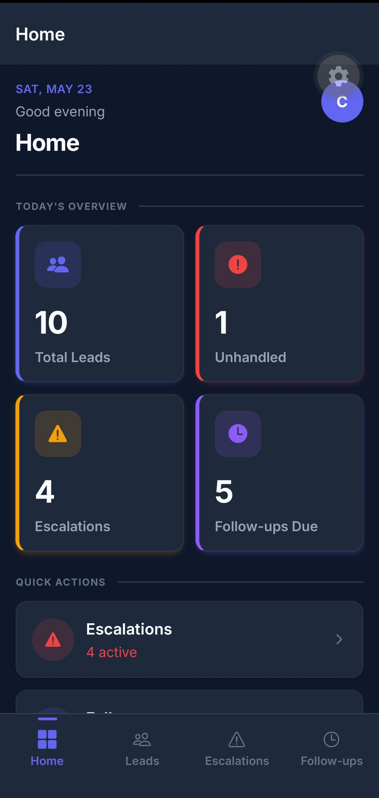
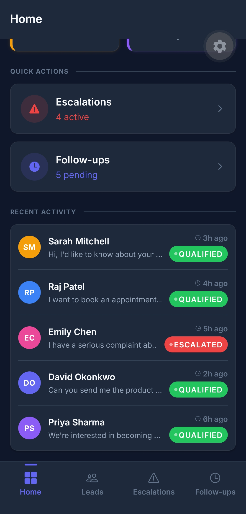
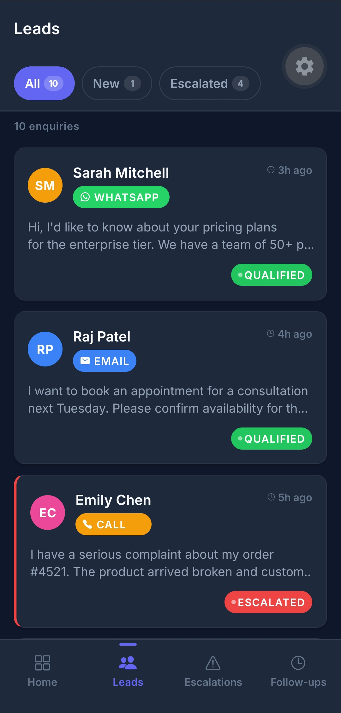
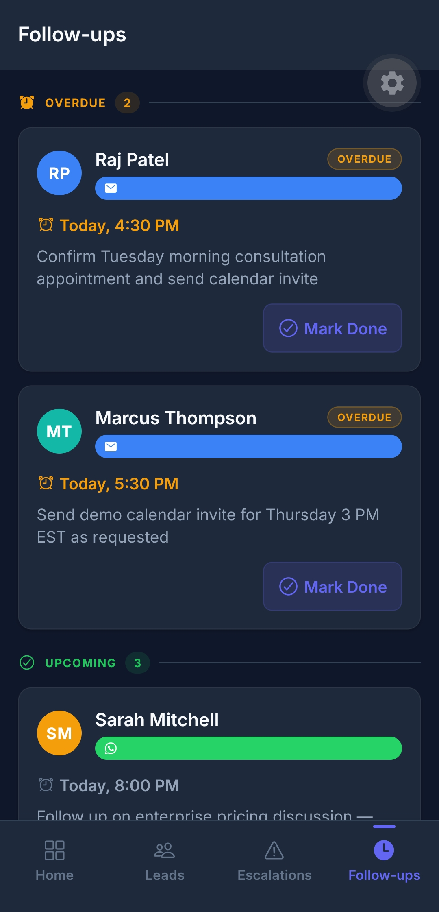
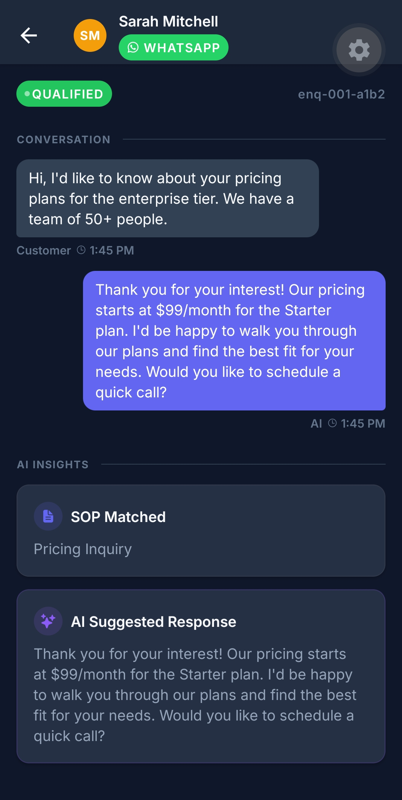
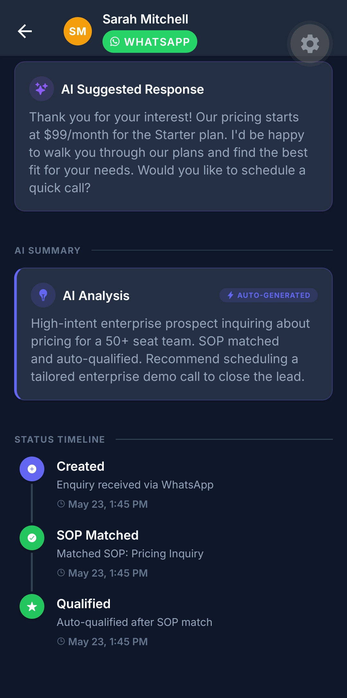

# Closira — Full-Stack Application

> **AI-powered customer communication platform for SMBs.**  
> This repository contains both the **Backend REST API + async worker** and the **Frontend React Native mobile dashboard** as a combined full-stack application.

**Backend:** Python 3.11 · FastAPI · PostgreSQL · Redis · Celery · Docker · SQLAlchemy 2 · Alembic · Pydantic v2  
**Frontend:** React Native · Expo SDK 56 · Expo Router v4 · TypeScript · Inter font

---

## 📹 Video Walkthrough

> **[Click here to watch the 3-minute video walkthrough](https://drive.google.com/file/d/1OwbO9cO9_oFgSGjx6Y2EhrbVtOA8vLSR/view?usp=sharing)**  
> *(Note: You can also find the `.mp4` file in the `docs/video/` folder of this repository).*

---

## Table of Contents

1. [Project Overview](#1-project-overview)  
2. [Repository Structure](#2-repository-structure)  
3. [Quick Start — Backend](#3-quick-start--backend)  
4. [Quick Start — Frontend](#4-quick-start--frontend)  
5. [Run Tests](#5-run-tests)  
6. [API Reference & Example Payloads](#6-api-reference--example-payloads)  
7. [Database Schema & Reasoning](#7-database-schema--reasoning)  
8. [Asynchronous Processing (Celery & Redis)](#8-asynchronous-processing-celery--redis)  
9. [SOP Matching Logic](#9-sop-matching-logic)  
10. [Structured Logging](#10-structured-logging)  
11. [Frontend — Screens & Navigation](#11-frontend--screens--navigation)  
12. [Frontend — Styling Decision (StyleSheet vs NativeWind)](#12-frontend--styling-decision-stylesheet-vs-nativewind)  
13. [Frontend — Mock Data Structure](#13-frontend--mock-data-structure)  
14. [Screenshots](#14-screenshots)  
15. [Trade-offs & Known Limitations](#15-trade-offs--known-limitations)  

---

## 1. Project Overview

Closira handles inbound customer enquiries across **WhatsApp, Email, and Phone**. When a new enquiry arrives:

1. The **REST API** accepts it, persists it, and synchronously runs the SOP keyword matching engine.
2. The SOP engine evaluates 8 pre-defined procedures using word-boundary-aware regex and keyword confidence scoring.
3. If a match is found → the enquiry is immediately `qualified` with a suggested response.
4. If no match → the enquiry is **auto-escalated** (status `escalated`) for human review.
5. In either case, the API returns the result (201 Created) containing `enquiry_id`, `status`, `sop_matched`, and `suggested_response` synchronously, preventing polling race conditions.
6. Business owners monitor all activity, resolve active escalations, and schedule/complete follow-ups via the **React Native mobile dashboard**.

---

## 2. Repository Structure

```
closira/
├── backend/
│   ├── app/
│   │   ├── api/
│   │   │   └── routes/
│   │   │       ├── enquiry.py       # POST /enquiry, GET /enquiry/{id}/history
│   │   │       ├── followup.py      # POST /enquiry/{id}/followup
│   │   │       ├── escalation.py    # POST /enquiry/{id}/escalate
│   │   │       └── health.py        # GET /health
│   │   ├── core/
│   │   │   ├── config.py            # Pydantic Settings (reads .env)
│   │   │   ├── database.py          # SQLAlchemy engine + session factory
│   │   │   └── logging.py           # JSON structured logger
│   │   ├── models/
│   │   │   ├── enquiry.py           # Enquiry ORM model
│   │   │   └── enquiry_event.py     # EnquiryEvent ORM model (timeline)
│   │   ├── schemas/
│   │   │   ├── enquiry.py           # Pydantic v2 request/response models
│   │   │   ├── followup.py
│   │   │   ├── escalation.py
│   │   │   └── health.py
│   │   ├── services/
│   │   │   ├── enquiry_service.py   # All business logic (no SQLAlchemy in routes)
│   │   │   └── sop_matcher.py       # 5-SOP keyword engine
│   │   ├── workers/
│   │   │   └── enquiry_processor.py # BackgroundTask: match → qualify or escalate
│   │   └── main.py                  # App factory, CORS, exception handlers
│   ├── alembic/                     # Migration infrastructure (env.py + versions/)
│   ├── tests/
│   │   ├── conftest.py              # Test DB fixtures + client
│   │   ├── test_enquiry.py          # 7 tests
│   │   ├── test_escalation.py       # 4 tests
│   │   ├── test_followup.py         # 4 tests
│   │   └── test_health.py           # 2 tests
│   ├── .env.example
│   ├── requirements.txt
│   └── docker-compose.yml
│
├── frontend/
│   ├── app/
│   │   ├── _layout.tsx              # Root layout (fonts + providers)
│   │   ├── (auth)/
│   │   │   ├── _layout.tsx          # Auth stack (headerless)
│   │   │   ├── login.tsx            # Login screen
│   │   │   ├── signup.tsx           # Signup screen
│   │   │   └── forgot-password.tsx  # Password reset screen
│   │   ├── (tabs)/
│   │   │   ├── _layout.tsx          # Bottom tab navigator (4 tabs)
│   │   │   ├── index.tsx            # Dashboard screen
│   │   │   ├── leads.tsx            # Leads list with filter pills
│   │   │   ├── escalations.tsx      # Active escalations with resolve
│   │   │   └── followups.tsx        # Follow-up task list
│   │   └── conversation/
│   │       └── [id].tsx             # Conversation detail (stack screen)
│   ├── components/
│   │   ├── cards/
│   │   │   ├── StatCard.tsx         # Dashboard stat tile
│   │   │   ├── LeadCard.tsx         # Lead list item
│   │   │   ├── EscalationCard.tsx   # Escalation with resolve button
│   │   │   └── FollowUpCard.tsx     # Follow-up with mark-done action
│   │   └── ui/
│   │       ├── ChannelBadge.tsx     # WhatsApp/Email/Call coloured badge
│   │       ├── StatusPill.tsx       # New/Qualified/Escalated pill
│   │       ├── UrgencyDot.tsx       # Pulsing dot for high/medium urgency
│   │       ├── EmptyState.tsx       # Graceful empty list component
│   │       ├── SkeletonCard.tsx     # Loading skeleton placeholder
│   │       └── NewEnquiryModal.tsx  # Bottom-sheet modal for new enquiries
│   ├── constants/
│   │   └── theme.ts                 # ALL design tokens (colors, spacing, fonts, shadows)
│   ├── context/
│   │   ├── ThemeContext.tsx          # Light/dark/system theme provider
│   │   ├── AuthContext.tsx           # Authentication state provider
│   │   ├── AppDataContext.tsx        # Global shared state store (React Context)
│   │   └── MockDataContext.tsx       # Mock data provider (demo mode)
│   ├── hooks/
│   │   └── useMockData.ts           # Thin hook wrapper over MockDataContext
│   ├── mock/
│   │   ├── enquiries.json           # 10 realistic enquiry records
│   │   ├── escalations.json         # 4 active escalation records
│   │   └── followups.json           # 5 follow-up task records
│   └── utils/
│       └── formatters.ts            # Timestamps, initials, avatar colours
│
└── README.md
```

---

## 3. Quick Start — Backend

### Prerequisites

- Python 3.11+
- `pip`

### Setup

```bash
cd backend

# 1. Create and activate a virtual environment
python -m venv venv

# Windows
venv\Scripts\activate

# macOS / Linux
source venv/bin/activate

# 2. Install dependencies
pip install -r requirements.txt

# 3. Set up environment variables
copy .env.example .env      # Windows
cp .env.example .env        # macOS/Linux

# 4. Run the development server
uvicorn app.main:app --reload --host 0.0.0.0 --port 8000
```

The API will be live at:  
- **Base URL:** `http://localhost:8000`  
- **Interactive docs:** `http://localhost:8000/docs`  
- **ReDoc:** `http://localhost:8000/redoc`

> The database (`closira.db`) is created automatically on first run — no migration step needed for development.

### Environment Variables (`.env`)

| Variable | Default | Description |
|---|---|---|
| `APP_NAME` | `Closira` | Application display name |
| `APP_VERSION` | `1.0.0` | Semantic version |
| `DEBUG` | `false` | Enable SQLAlchemy echo mode |
| `DATABASE_URL` | `sqlite:///./closira.db` | SQLAlchemy connection string |
| `LOG_LEVEL` | `INFO` | Python logging level |

### Docker (optional)

```bash
cd backend
docker-compose up --build
```

---

## 4. Quick Start — Frontend

### Prerequisites

- Node.js 18+
- `npm`
- **Expo Go** app installed on your iOS or Android device, **OR** an emulator

### Setup

```bash
cd frontend

# 1. Install dependencies
npm install

# 2. Start the Expo development server
npx expo start
```

Then:
- **Physical device:** Scan the QR code with the Expo Go app
- **iOS simulator:** Press `i`
- **Android emulator:** Press `a`
- **Web browser:** Press `w`

> The frontend is **fully self-contained** — it uses hardcoded mock data and does not require the backend to be running.

---

## 5. Run Tests

```bash
cd backend

# Run all 17 tests with verbose output
python -m pytest tests/ -v --tb=short
```

**Expected output:**

```
tests/test_health.py::TestHealth::test_health_returns_200 PASSED
tests/test_health.py::TestHealth::test_health_returns_db_connected PASSED
tests/test_enquiry.py::TestCreateEnquiry::test_create_enquiry_returns_202 PASSED
tests/test_enquiry.py::TestCreateEnquiry::test_create_enquiry_with_email_channel PASSED
tests/test_enquiry.py::TestCreateEnquiry::test_create_enquiry_with_call_channel PASSED
tests/test_enquiry.py::TestCreateEnquiry::test_create_enquiry_invalid_channel PASSED
tests/test_enquiry.py::TestCreateEnquiry::test_create_enquiry_missing_fields PASSED
tests/test_enquiry.py::TestCreateEnquiry::test_create_enquiry_empty_name PASSED
tests/test_enquiry.py::TestEnquiryHistory::test_history_returns_structured_response PASSED
tests/test_enquiry.py::TestEnquiryHistory::test_history_not_found PASSED
tests/test_escalation.py::TestEscalation::test_escalate_returns_200 PASSED
tests/test_escalation.py::TestEscalation::test_escalate_already_escalated_returns_409 PASSED
tests/test_escalation.py::TestEscalation::test_escalate_empty_reason_returns_422 PASSED
tests/test_escalation.py::TestEscalation::test_escalate_not_found_returns_404 PASSED
tests/test_followup.py::TestFollowUp::test_followup_returns_200 PASSED
tests/test_followup.py::TestFollowUp::test_followup_with_template PASSED
tests/test_followup.py::TestFollowUp::test_followup_invalid_delay_returns_422 PASSED
tests/test_followup.py::TestFollowUp::test_followup_not_found_returns_404 PASSED

==================== 17 passed in 1.07s ==========================
```

---

## 6. API Reference & Example Payloads

> All examples below can be run with `curl`. The interactive `/docs` page also lets you try each endpoint with pre-filled example payloads.

### `GET /health`

Returns API status and database connectivity.

```bash
curl http://localhost:8000/health
```

**200 OK — Healthy:**
```json
{ "status": "ok", "db": "connected" }
```

**503 Service Unavailable — Degraded:**
```json
{ "status": "degraded", "db": "unreachable" }
```

---

### `POST /enquiry`

Creates a new inbound customer enquiry, runs the SOP matching engine synchronously, and returns the result immediately.

```bash
curl -X POST http://localhost:8000/enquiry \
  -H "Content-Type: application/json" \
  -d '{
    "channel": "whatsapp",
    "customer_name": "Sarah Mitchell",
    "message": "Hi, I would like to know about your pricing plans for the enterprise tier."
  }'
```

**201 Created (Matched SOP):**
```json
{
  "enquiry_id": "a1b2c3d4-e5f6-7890-abcd-ef1234567890",
  "status": "qualified",
  "sop_matched": "Pricing Inquiry",
  "suggested_response": "Thank you for your interest! Our pricing starts at $99/month for the Starter plan. I'd be happy to walk you through our plans and find the best fit for your needs. Would you like to schedule a quick call?",
  "message": "Enquiry processed — matched SOP: Pricing Inquiry"
}
```

**201 Created (No SOP match — auto-escalated):**
```json
{
  "enquiry_id": "b2c3d4e5-f678-9012-bcde-f1234567890a",
  "status": "escalated",
  "sop_matched": null,
  "suggested_response": null,
  "message": "Enquiry processed — no SOP match, escalated for review."
}
```

**Accepted channel values:** `whatsapp`, `email`, `call`

**422 Validation Error (invalid channel):**
```json
{
  "errors": [
    {
      "field": "body → channel",
      "message": "Input should be 'whatsapp', 'email' or 'call'",
      "type": "enum"
    }
  ]
}
```

---

### `POST /enquiry/{id}/followup`

Schedules a follow-up for an open enquiry.

```bash
# Replace {id} with a real job_id from POST /enquiry
curl -X POST http://localhost:8000/enquiry/a1b2c3d4-e5f6-7890-abcd-ef1234567890/followup \
  -H "Content-Type: application/json" \
  -d '{
    "delay_minutes": 30,
    "message_template": "Hi {customer_name}, just following up on your enquiry about {topic}."
  }'
```

**200 OK:**
```json
{
  "enquiry_id": "a1b2c3d4-e5f6-7890-abcd-ef1234567890",
  "status": "followed_up",
  "delay_minutes": 30,
  "message": "Follow-up scheduled in 30 minutes."
}
```

**409 Conflict (enquiry resolved — cannot follow up):**
```json
{
  "error": "Cannot schedule follow-up for enquiry ... — status is 'resolved'."
}
```

---

### `POST /enquiry/{id}/escalate`

Escalates an enquiry to a human agent. Idempotent — escalating an already-escalated enquiry returns `409`.

```bash
curl -X POST http://localhost:8000/enquiry/a1b2c3d4-e5f6-7890-abcd-ef1234567890/escalate \
  -H "Content-Type: application/json" \
  -d '{
    "reason": "Customer is a VIP account holder requesting immediate attention."
  }'
```

**200 OK:**
```json
{
  "enquiry_id": "a1b2c3d4-e5f6-7890-abcd-ef1234567890",
  "status": "escalated",
  "reason": "Customer is a VIP account holder requesting immediate attention.",
  "message": "Enquiry escalated successfully."
}
```

**409 Conflict (already escalated):**
```json
{
  "error": "Enquiry a1b2c3d4-... is already escalated. Current reason: VIP customer..."
}
```

---

### `GET /enquiry/{id}/history`

Returns the full conversation history and status timeline.

```bash
curl http://localhost:8000/enquiry/a1b2c3d4-e5f6-7890-abcd-ef1234567890/history
```

**200 OK:**
```json
{
  "enquiry": {
    "id": "a1b2c3d4-e5f6-7890-abcd-ef1234567890",
    "channel": "whatsapp",
    "customer_name": "Sarah Mitchell",
    "message": "Hi, I would like to know about your pricing plans...",
    "status": "qualified",
    "sop_matched": "Pricing Inquiry",
    "suggested_response": "Thank you for your interest! Our pricing starts at $99/month...",
    "escalation_reason": null,
    "created_at": "2025-01-15T10:30:00",
    "updated_at": "2025-01-15T10:30:01"
  },
  "timeline": [
    {
      "id": "evt-001",
      "event_type": "created",
      "detail": "{\"channel\": \"whatsapp\", \"customer_name\": \"Sarah Mitchell\"}",
      "created_at": "2025-01-15T10:30:00"
    },
    {
      "id": "evt-002",
      "event_type": "sop_matched",
      "detail": "{\"sop_name\": \"Pricing Inquiry\"}",
      "created_at": "2025-01-15T10:30:01"
    },
    {
      "id": "evt-003",
      "event_type": "qualified",
      "detail": "{\"sop\": \"Pricing Inquiry\", \"suggested_response\": \"Thank you...\"}",
      "created_at": "2025-01-15T10:30:01"
    }
  ]
}
```

**404 Not Found:**
```json
{ "error": "Enquiry nonexistent-id not found" }
```

---

### `POST /enquiry/{id}/resolve`

Marks an escalated enquiry as resolved. The enquiry must be in `escalated` status.

```bash
curl -X POST http://localhost:8000/enquiry/a1b2c3d4-e5f6-7890-abcd-ef1234567890/resolve
```

**200 OK:**
```json
{
  "id": "a1b2c3d4-e5f6-7890-abcd-ef1234567890",
  "channel": "whatsapp",
  "customer_name": "Sarah Mitchell",
  "message": "Hi, I would like to know about your pricing plans...",
  "status": "resolved",
  "sop_matched": "Pricing Inquiry",
  "suggested_response": "Thank you for your interest...",
  "escalation_reason": "Manual escalation",
  "created_at": "2025-01-15T10:30:00",
  "updated_at": "2025-01-15T10:32:00"
}
```

---

### `POST /enquiry/{id}/complete-followup`

Marks a follow-up task as completed/resolved. The enquiry must be in `followed_up` status.

```bash
curl -X POST http://localhost:8000/enquiry/a1b2c3d4-e5f6-7890-abcd-ef1234567890/complete-followup
```

**200 OK:**
```json
{
  "id": "a1b2c3d4-e5f6-7890-abcd-ef1234567890",
  "channel": "whatsapp",
  "customer_name": "Sarah Mitchell",
  "message": "Hi, I would like to know about your pricing plans...",
  "status": "resolved",
  "sop_matched": "Pricing Inquiry",
  "suggested_response": "Thank you for your interest...",
  "escalation_reason": null,
  "created_at": "2025-01-15T10:30:00",
  "updated_at": "2025-01-15T10:35:00"
}
```

---

### `GET /escalations`

Returns all currently escalated enquiries with their urgency level inferred from the escalation reason.

```bash
curl http://localhost:8000/escalations
```

**200 OK:**
```json
{
  "data": [
    {
      "id": "esc-a1b2c3d4-e5f6-7890-abcd-ef1234567890",
      "enquiry_id": "a1b2c3d4-e5f6-7890-abcd-ef1234567890",
      "channel": "whatsapp",
      "customer_name": "Sarah Mitchell",
      "reason": "VIP account holder requesting immediate attention.",
      "urgency": "high",
      "message_preview": "Hi, I would like to know about your pricing plans...",
      "created_at": "2025-01-15T10:30:00"
    }
  ],
  "total": 1
}
```

---

### `GET /followups`

Returns all pending follow-up enquiries with dynamic due dates (approximated as 30 minutes from booking).

```bash
curl http://localhost:8000/followups
```

**200 OK:**
```json
{
  "data": [
    {
      "id": "a1b2c3d4-e5f6-7890-abcd-ef1234567890",
      "enquiry_id": "a1b2c3d4-e5f6-7890-abcd-ef1234567890",
      "customer_name": "Sarah Mitchell",
      "channel": "whatsapp",
      "message_preview": "Hi, I would like to know about your pricing plans...",
      "due_at": "2025-01-15T11:00:00",
      "status": "pending"
    }
  ],
  "total": 1
}
```

---

## 7. Database Schema & Reasoning

### Schema

```sql
-- enquiries: one row per inbound customer enquiry
CREATE TABLE enquiries (
    id                  TEXT PRIMARY KEY,          -- UUID4, generated at insert
    channel             TEXT NOT NULL,             -- 'whatsapp' | 'email' | 'call'
    customer_name       TEXT NOT NULL,             -- VARCHAR(255)
    message             TEXT NOT NULL,             -- Full message body
    status              TEXT NOT NULL DEFAULT 'new',
                                                   -- 'new' | 'qualified' | 'escalated'
                                                   -- | 'followed_up' | 'resolved'
    sop_matched         TEXT,                      -- SOP name (null until SOP matched)
    suggested_response  TEXT,                      -- Response template (null until matched)
    escalation_reason   TEXT,                      -- Reason text (null unless escalated)
    created_at          DATETIME NOT NULL,         -- UTC, set at creation
    updated_at          DATETIME NOT NULL          -- UTC, updated on every state change
);

-- enquiry_events: immutable append-only audit log (one row per lifecycle event)
CREATE TABLE enquiry_events (
    id          TEXT PRIMARY KEY,                  -- UUID4
    enquiry_id  TEXT NOT NULL REFERENCES enquiries(id),
    event_type  TEXT NOT NULL,                     -- 'created' | 'sop_matched' | 'qualified'
                                                   -- | 'escalated' | 'followup_scheduled'
                                                   -- | 'followup_sent' | 'resolved'
    detail      TEXT,                              -- JSON string with event metadata (nullable)
    created_at  DATETIME NOT NULL                  -- UTC timestamp of this event
);

-- Index on FK for fast timeline queries
CREATE INDEX idx_enquiry_events_enquiry_id ON enquiry_events(enquiry_id);
```

### Design Decisions

**Why two tables?**  
The `enquiries` table stores the current state of a lead. The `enquiry_events` table is an append-only audit log — every status change writes a new row. This separates "what is the current state" (single row query) from "how did we get here" (ordered timeline query), which maps directly to what the dashboard needs.

**Why UUID4 primary keys stored as TEXT?**  
Storing as `TEXT(36)` is portable across databases, avoiding issues if migrating away from PostgreSQL to another database without native UUID types.

**Why PostgreSQL?**  
PostgreSQL is used as the primary database for robust concurrent writes and data integrity, ensuring reliable production performance when tracking many enquiries simultaneously.

---

## 8. Asynchronous Processing (Celery & Redis)

**We chose Celery and Redis for asynchronous background tasks.**

While synchronous processing can work for trivial regex matches, moving to Celery ensures that the application is fully prepared for real-world scaling, such as replacing basic keyword matching with external LLM API calls.

1. **Scalability:** Heavy processing tasks (like LLM-based SOP matching or sending follow-up emails) are offloaded to background Celery workers, keeping the main FastAPI API highly responsive.
2. **Reliability:** Celery provides robust retries, dead-letter queuing, and task monitoring out of the box.
3. **Decoupled code:** The matching engine is fully isolated in `app/services/sop_matcher.py`, making it straightforward to dispatch tasks to the Celery worker queue using Redis as the message broker.

---

## 9. SOP Matching Logic

Eight SOPs are defined in [`app/services/sop_matcher.py`](backend/app/services/sop_matcher.py) to cover all common CRM categories.

| SOP Name | Trigger Keywords | Suggested Response Summary |
|---|---|---|
| **Pricing Inquiry** | price, pricing, cost, rate, fee, charge, quote, subscription, plan, tier, discount, coupon, promo, budget, afford, expensive, cheap, license | Quotes starting price of $99/mo and offers call. |
| **Booking & Appointment** | book, booking, appointment, schedule, reserve, availability, calendar, slot, meeting, consultation, demo, session, reschedule | Asks for preferred date and time to confirm. |
| **Complaint Resolution** | complaint, issue, problem, unhappy, dissatisfied, broken, defect, damaged, frustrated, unacceptable, terrible, worst, disappointed | Apologizes, promises support reply in 2 hours, requests order number. |
| **Product Information** | feature, product, service, detail, specification, trial, capability, integrate, integration, how does, what does, tell me about, information | Details analytics, workflows, 24/7 support, offers demo. |
| **Partnership & Collaboration** | partner, partnership, collaborate, collaboration, wholesale, reseller, affiliate, agency, white label, referral, commission, joint venture | Refers to BD team, promises reply in 24 hours. |
| **Billing & Payment** | bill, billing, invoice, payment, charged, charge, refund, overcharged, double charged, transaction, receipt, credit card, bank, statement, subscription | Apologizes for billing issue, escalates to finance, requests invoice/email. |
| **Technical Support** | bug, error, crash, not working, doesn't work, login, password, access, revoked, locked out, outage, down, slow, glitch, fix, troubleshoot, reset, update, install, setup | Offers troubleshooting and escalation to dev team. |
| **General Inquiry** | hello, hi, hey, help, question, ask, know, curious, wondering, inquiry, enquiry, contact, reach, talk, speak, support, assist | Greeting, asks for clarification of needs. |

### Match Algorithm & Optimization

1. **Word-Boundary Matching:** Instead of simple substring matching (which would incorrectly match "price" in "sur**price**" or "cost" in "ac**cost**"), keywords are compiled into regular expressions with word boundary tokens (`\bkeyword\b`), matched case-insensitively.
2. **Confidence Scoring:** The message is checked against all 8 SOPs. Rather than picking the first match, we count the number of keyword hits for each SOP. The SOP with the highest hit count (confidence score) is selected.
3. **Tie-Breaker:** In case of scoring ties, the SOP listed first (more specific categories) is preferred.
4. **No Match → Auto-Escalation:** If zero keywords are matched across all SOPs, the enquiry is marked as `escalated` with the reason `"No SOP matched — requires manual review"`.

---

## 10. Structured Logging

Every log line is a single-line valid JSON object. No `print()` statements exist anywhere in the codebase — all output goes through the structured logger in [`app/core/logging.py`](backend/app/core/logging.py).

**Log schema:**
```json
{
  "timestamp": "2025-01-15T10:30:00.000Z",
  "level": "INFO",
  "event": "enquiry_created",
  "enquiry_id": "a1b2c3d4-e5f6-7890-abcd-ef1234567890",
  "detail": "Channel: whatsapp, Customer: Sarah Mitchell"
}
```

**Logged events:**

| Event Key | Level | When |
|---|---|---|
| `app_startup` | INFO | Application starts |
| `enquiry_created` | INFO | `POST /enquiry` succeeds |
| `background_task_started` | INFO | Worker picks up a new enquiry |
| `sop_matched` | INFO | A keyword match is found |
| `enquiry_qualified` | INFO | Enquiry status → qualified |
| `sop_no_match` | WARNING | No SOP keywords found |
| `enquiry_auto_escalated` | WARNING | Auto-escalation triggered |
| `enquiry_escalated` | INFO | Manual escalation via API |
| `followup_scheduled` | INFO | Follow-up recorded |
| `validation_error` | WARNING | Pydantic 422 triggered |
| `business_rule_violation` | WARNING | 409 Conflict triggered |
| `unhandled_exception` | ERROR | Catch-all — full traceback logged, never returned to client |

---

## 11. Frontend — Screens & Navigation

### Navigation Structure

```
Root Stack (_layout.tsx)
└── Tab Navigator ((tabs)/_layout.tsx)
    ├── Home           → Dashboard screen    (index.tsx)
    ├── Leads          → Leads list          (leads.tsx)
    ├── Escalations    → Escalation alerts   (escalations.tsx)
    └── Follow-ups     → Task list           (followups.tsx)
        
Stack Screen (outside tabs):
└── /conversation/[id]  → Conversation detail  ([id].tsx)
```

The tab bar uses a custom `TabIcon` component with a **pill indicator** (indigo, 20×3 px) above the active icon, and active icons render 2 dp larger than inactive.

### Screen Summary

| Screen | Key Features |
|---|---|
| **Dashboard** | Date-aware greeting header · 2×2 stat grid (Total Leads, Unhandled, Escalations, Follow-ups Due) · Quick-action cards with counts · Recent activity feed (last 5 enquiries) |
| **Leads** | FlatList with filter pills (All / New / Escalated) · Channel badge + Status pill on each card · Relative timestamps · Tap → Conversation Detail |
| **Escalations** | Active escalation cards with red left accent bar · Pulsing urgency dot (red=high, amber=medium) · Animated resolve button (spring scale → checkmark) · `LayoutAnimation` card removal · Empty state with shield icon |
| **Follow-ups** | Task cards with formatted due times ("Today, 2:30 PM") · Mark Done button → strikethrough → 300 ms fade → removed after 400 ms · Empty state |
| **Conversation Detail** | Customer/AI message bubbles (left/right) · SOP Matched info box · AI Summary box with "AUTO-GENERATED" badge · Escalation reason box (red border) · Vertical status timeline with coloured icon dots |

---

## 12. Frontend — Styling & Theming

### Theme Architecture

The app supports **light, dark, and system** themes. The theme preference is persisted in `AsyncStorage` and survives app restarts.

**How it works:**

1. **`constants/theme.ts`** defines two complete colour palettes (`darkColors` and `lightColors`), shadow presets (`darkShadows` / `lightShadows`), and a theme-aware `getStatusConfig()` function.
2. **`context/ThemeContext.tsx`** resolves the active palette based on user preference or system setting and provides it via `useTheme()`.
3. **Every component** consumes `const { colors, shadows, statusConfig } = useTheme()` and uses a `makeStyles(colors)` factory so all colours switch dynamically.

```typescript
// Component pattern used everywhere:
const { colors, shadows } = useTheme();
const styles = makeStyles(colors);

const makeStyles = (colors: any) =>
  StyleSheet.create({
    card: {
      backgroundColor: colors.surface,      // white in light, dark slate in dark
      borderColor: colors.borderSubtle,      // rgba(0,0,0,0.06) / rgba(255,255,255,0.06)
    },
  });
```

To toggle the theme programmatically: `toggleTheme()` or `setTheme('light' | 'dark' | 'system')`.

### Styling Decision (StyleSheet vs NativeWind)

**We used React Native's built-in `StyleSheet` API throughout.**

> NativeWind v4 is installed (`package.json` includes `"nativewind": "^4.2.4"`) and available for future use, but `StyleSheet` provides better alignment with the design system requirements for this assignment.

**1. Design tokens require computed values.**  
All design tokens live in [`constants/theme.ts`](frontend/constants/theme.ts) — a typed TypeScript object with semantic colour names, a strict 4pt spacing grid, border-radius scale, shadow presets, and font size tokens. `StyleSheet` references these directly.

**2. Platform-specific shadows.**  
iOS uses `shadowColor/shadowOffset/shadowOpacity/shadowRadius`; Android uses `elevation`. The theme provides separate `lightShadows` (subtle) and `darkShadows` (dramatic) presets.

**3. Animation requires runtime values.**  
`FollowUpCard` uses `Animated.Value` for its fade-out animation. `EscalationCard` uses `Animated.spring` for the resolve button scale feedback. These animations drive `StyleSheet` properties at runtime — NativeWind's static class compilation cannot drive runtime `Animated.Value` objects.

---

## 13. Frontend — Mock Data Structure

All mock data lives in [`frontend/mock/`](frontend/mock/) as structured JSON, mirroring the shape of real API responses.

**`enquiries.json`** — 10 records covering all status values:
```json
{
  "data": [
    {
      "id": "enq-001-a1b2",
      "channel": "whatsapp",
      "customer_name": "Sarah Mitchell",
      "message": "Hi, I'd like to know about your pricing plans...",
      "status": "qualified",
      "sop_matched": "Pricing Inquiry",
      "suggested_response": "Thank you for your interest! Our pricing starts at $99/month...",
      "ai_summary": "High-intent enterprise prospect inquiring about pricing...",
      "escalation_reason": null,
      "created_at": "2026-05-23T08:15:00Z",
      "updated_at": "2026-05-23T08:15:02Z",
      "messages": [
        { "id": "msg-001", "sender": "customer", "text": "...", "timestamp": "..." },
        { "id": "msg-002", "sender": "ai", "text": "...", "timestamp": "..." }
      ],
      "timeline": [
        { "event_type": "created", "detail": "Enquiry received via WhatsApp", "created_at": "..." },
        { "event_type": "sop_matched", "detail": "Matched SOP: Pricing Inquiry", "created_at": "..." },
        { "event_type": "qualified", "detail": "Auto-qualified after SOP match", "created_at": "..." }
      ]
    }
  ],
  "total": 10,
  "page": 1
}
```

The schema is deliberately API-ready: field names match the FastAPI response models exactly. Swapping mock data for a real API call requires only replacing `useMockData()` with a `useAPIData()` hook — the component layer is unchanged.

**State management:** Mock data is served from `MockDataContext` (a React Context Provider wrapping the root layout). This ensures mutations (`resolveEscalation`, `markFollowUpDone`) propagate to **all tabs simultaneously** — e.g., resolving an escalation updates the Dashboard count in real time.

---

## 14. Screenshots

> **Reviewer instructions:** Screenshots and a 2–5 minute video walkthrough are provided as separate submission attachments.  
> To capture your own screenshots, run `npx expo start` and use Expo Go on a physical device or simulator.

### Dashboard Screen
<div align="center">
  &nbsp;&nbsp;&nbsp;&nbsp;
</div>

Shows the date-aware header, 2×2 stat grid (Total Leads, Unhandled, Escalations, Follow-ups Due), quick-action cards, and recent activity feed.

---

### Leads Screen
<div align="center">
  
</div>

Shows the FlatList with filter pills (All / New / Escalated), each card displaying a channel badge (WhatsApp green, Email blue, Call amber), customer name, message preview, relative time, and status pill.

---

### Escalations Screen
*Replace with screenshot: `docs/screenshots/escalations.png`*

Shows active escalation cards with red left accent bar, pulsing urgency dots, reason text, message preview, and the animated Resolve button. Also shows the empty state after all escalations are resolved.

---

### Follow-ups Screen
<div align="center">
  
</div>

Shows task cards with formatted due times and the Mark Done animation (strikethrough → fade → remove).

---

### Conversation Detail Screen
<div align="center">
  &nbsp;&nbsp;&nbsp;&nbsp;
</div>

Shows the message thread (customer left grey, AI right indigo), SOP Matched info box, AI Summary box with "AUTO-GENERATED" badge, and the vertical status timeline with coloured icon dots.

---

## 15. Trade-offs & Known Limitations

| Area | Decision | Trade-off | Mitigation / Production Path |
|---|---|---|---|
| **Follow-up execution** | Delay is recorded in DB but not executed | No scheduler for actual delayed message sending | Add APScheduler, Celery Beat, or a cron system to actually dispatch messages at `scheduled_at` |
| **Rate limiting** | None | Endpoints can be spammed | Add `slowapi` or deploy behind an API gateway with rate limiting |
| **Pagination** | Lists return all items | Slow at high volume | Add `skip`/`limit` query parameters to the history and list endpoints |
| **SOP matching** | Substring keyword check | "mispriced" matches "price", no ranking | Replace with TF-IDF, word-boundary tokenisation, or an LLM classifier |
| **No i18n** | English only | Not internationalisation-ready | All user-facing strings are co-located in component files and extractable |

---

## License

MIT
